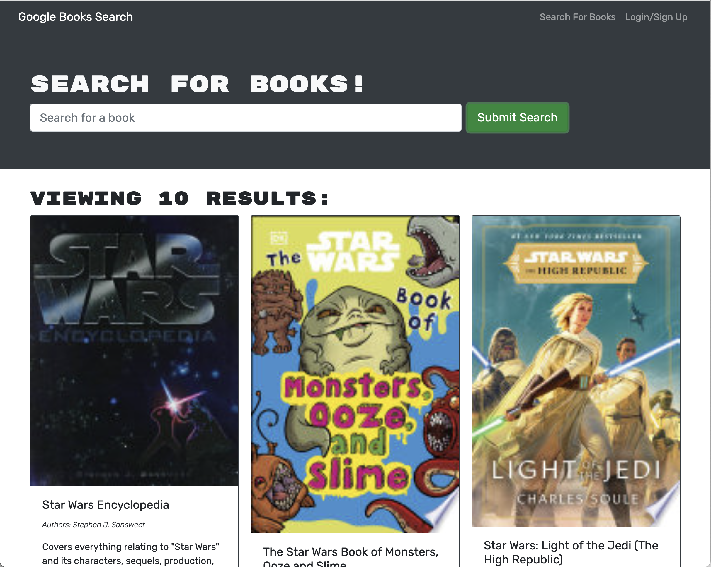

  # Books Books Books
  

## Screenshot

  ## Description 
      
This is a book search and save app using google book API. Has been converted to a more efficiant application using MERN (MongoDB, Express.js, React and Node.js).
      
  [GitHub Repo](https://github.com/JosephJamesCoop/books-books-books)
      
   [Live App](https://protected-brushlands-50335.herokuapp.com/)
      
  ## Table of Contents (Optional)
      
  none
      
      
  ## Installation
      
  click on the word [LINK](https://github.com/JosephJamesCoop/books-books-books) select download or install with HTML or SSH. run npm install then NPM start.
      
  ## Usage 
      
  used for researching and saving books that you may be interested in or read once you finish you current book.
      
  ## Credits
      
  [Joseph Cooper](https://github.com/JosephJamesCoop) 
  
    
            
      
      

      

   
      
